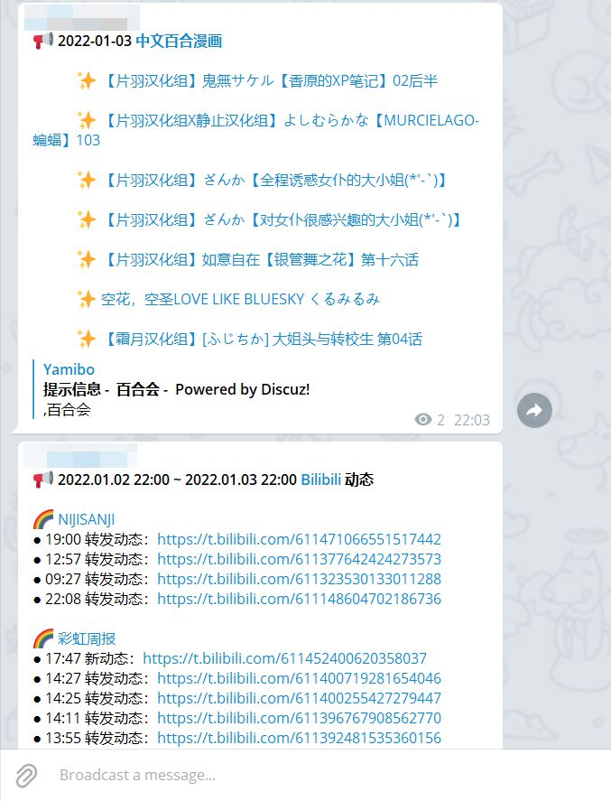

# tg-bot

使用 telegram bot 往频道内定时推送消息：
1. 每天早上 6:30 推送 Bing 壁纸
2. 每天晚上 22:00 推送百合会漫画更新
3. 每天晚上 22:00 推送 Bilibili 动态更新
4. 每周六早上 7:45 推送 Pixiv 周榜

注意事项
- 上面的时间是 Github Action 开始运行的时间，推送到频道内会有一定的延迟；
- Bing 每日壁纸的爬取是根据 UTC 时间，比北京时间慢 8h；
- 百合会论坛内容按积分限制查看，这里并不能绕过，推送是 `昨日 22:00 ~ 今日 22:00` 之间发布的中文漫画（北京时间）；
- Bilibili 动态推送是 `昨日 22:00 ~ 今日 22:00` 之间的动态（最多 12 条）；
- Pixiv 周榜推送前十的插画。

Telegram 推送结果

## 说明

**支持本仓库请 star**

使用方式同 [jckling/Daily-Bonus](https://github.com/jckling/Daily-Bonus)，fork 本仓库然后设置 Actions Secrets 就可以运行了。自定义推送时间修改 .github/workflows/ 目录下对应的配置文件即可，时间格式参考 [events-that-trigger-workflows#schedule](https://docs.github.com/en/actions/using-workflows/events-that-trigger-workflows#schedule) 。

| Secret 名称            | 描述                   |
| --------------------- | --------------------- |
| TOKEN                 | telegram bot token    |
| CHAT_ID               | telegram channel name |
| PIXIV_REFRESH_TOKEN   | Pixiv refresh_token   |
| YAMIBO_COOKIES        | 百合会 Cookie           |

1. token 从 [@BotFather](https://telegram.me/botfather) 获取，chat_id 就是 `@bot`（假设频道链接为 https://t.me/bot）
2. Pixiv `refresh_token` 获取参见👉 [获取 Refresh Token](https://gist.github.com/upbit/6edda27cb1644e94183291109b8a5fde)
   - 如果使用 Chrome 可以从 [ChromeDriver - WebDriver for Chrome](https://chromedriver.chromium.org/downloads) 查看和下载对应版本的 chromedriver
3. 百合会论坛 `Cookie` 获取参见👉 [V2EX Cookie 查看](https://github.com/jckling/Daily-Bonus//#v2ex)

Bilibili 动态推送需要在 bilibili/uids.txt 添加 uid：
- 网页端 - 点击头像进入个人空间 - https://space.bilibili.com/uid
- 移动端 - 点击头像进入个人空间 - 个人签名最右侧点击详情查看

# 相关链接

参阅
- [Bots: An introduction for developers](https://core.telegram.org/bots)
- [python-telegram-bot](https://github.com/python-telegram-bot/python-telegram-bot)
- [upbit/pixivpy](https://github.com/upbit/pixivpy)
- [SK-415/HarukaBot](https://github.com/SK-415/HarukaBot)

问题与解决
- [How to Update All Python Packages - ActiveState](https://www.activestate.com/resources/quick-reads/how-to-update-all-python-packages/)
- [python - RuntimeWarning: Enable tracemalloc to get the object allocation traceback - Not using async - Stack Overflow](https://stackoverflow.com/questions/75076069/runtimewarning-enable-tracemalloc-to-get-the-object-allocation-traceback-not)
- [Coroutines and Tasks — Python 3.11.4 documentation](https://docs.python.org/3/library/asyncio-task.html)